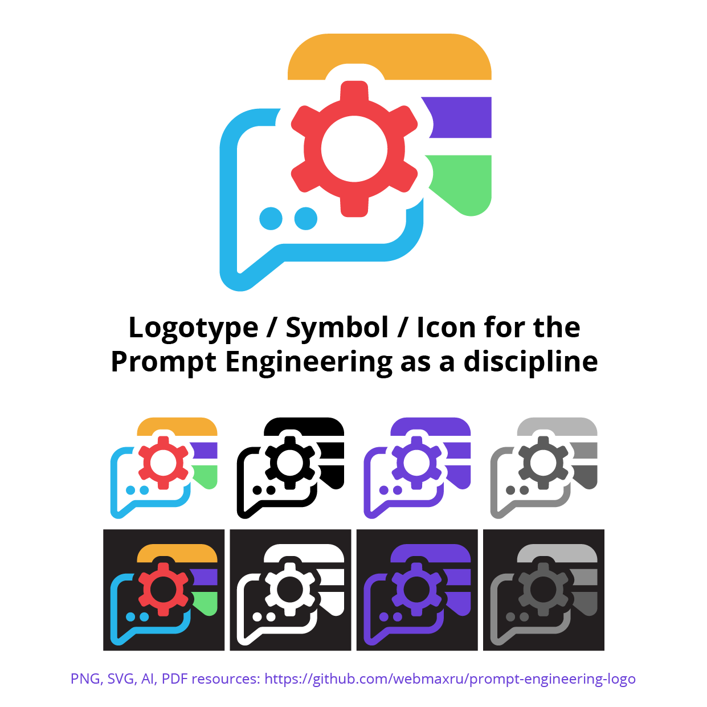

# Prompt Engineering Logo

    

*Prompt Engineering is the technique of formulating instructions (“prompts”) for a generative AI, in order to have it produce the expected output. ([Wiktionary](https://en.m.wiktionary.org/wiki/prompt_engineering))*

This is an emerging field, and there are more and more resources available such as courses, presentations, and articles. Now is the perfect time to start learning and utilizing it in your projects. Additionally, now is an excellent time to have a logo for it! I created the logo based on my vision and dedicated it to the public domain, so **anyone can legally use it without permission**.

    

### Author
* Maxim Salnikov. [LinkedIn](https://linkedin.com/in/webmax/), [Twitter @webmaxru](https://twitter.com/webmaxru), [GitHub @webmaxru](https://github.com/webmaxru)

## Description

An input message (prompt) consisting of multiple parts (tokens) and an output message with a response generated (dots) are connected by a cogwheel, symbolizing engineering. The colors are vibrant and work well on both light and dark backgrounds. There is no text in the logo, making it more of a symbol or icon than a logo. This is intentional, as it is a logo for a concept, not a company. If text is needed, any font that fits the design can be used.

## Assets

### Vector (SVG)

- Default [view](https://github.com/webmaxru/prompt-engineering-logo/blob/main/assets/prompt-engineering-logo.svg) | [download](https://github.com/webmaxru/prompt-engineering-logo/raw/main/assets/prompt-engineering-logo.svg)

- White [view](https://github.com/webmaxru/prompt-engineering-logo/blob/main/assets/prompt-engineering-logo%20(white).svg) | [download](https://github.com/webmaxru/prompt-engineering-logo/raw/main/assets/prompt-engineering-logo%20(white).svg)

- Black [view](https://github.com/webmaxru/prompt-engineering-logo/blob/main/assets/prompt-engineering-logo%20(black).svg) | [download](https://github.com/webmaxru/prompt-engineering-logo/raw/main/assets/prompt-engineering-logo%20(black).svg)

- Grayscale [view](https://github.com/webmaxru/prompt-engineering-logo/blob/main/assets/prompt-engineering-logo%20(grayscale).svg) | [download](https://github.com/webmaxru/prompt-engineering-logo/raw/main/assets/prompt-engineering-logo%20(grayscale).svg)

- Monochrome [view](https://github.com/webmaxru/prompt-engineering-logo/blob/main/assets/prompt-engineering-logo%20(mono).svg) | [download](https://github.com/webmaxru/prompt-engineering-logo/raw/main/assets/prompt-engineering-logo%20(mono).svg)

- Sticker "Prompt Engineering" [view](https://github.com/webmaxru/prompt-engineering-logo/blob/main/assets/sticker_prompt-engineering.svg) | [download](https://github.com/webmaxru/prompt-engineering-logo/raw/main/assets/sticker_prompt-engineering.svg)

- Sticker "I'm a Prompt Engineer" [view](https://github.com/webmaxru/prompt-engineering-logo/blob/main/assets/sticker_i-am-a-prompt-engineer.svg) | [download](https://github.com/webmaxru/prompt-engineering-logo/raw/main/assets/sticker_i-am-a-prompt-engineer.svg)

### High resolution PNGs with transparent background

- Default [view](https://github.com/webmaxru/prompt-engineering-logo/blob/main/assets/prompt-engineering-logo.png) | [download](https://github.com/webmaxru/prompt-engineering-logo/raw/main/assets/prompt-engineering-logo.png)

- White [view](https://github.com/webmaxru/prompt-engineering-logo/blob/main/assets/prompt-engineering-logo%20(white).png) | [download](https://github.com/webmaxru/prompt-engineering-logo/raw/main/assets/prompt-engineering-logo%20(white).png)

- Black [view](https://github.com/webmaxru/prompt-engineering-logo/blob/main/assets/prompt-engineering-logo%20(black).png) | [download](https://github.com/webmaxru/prompt-engineering-logo/raw/main/assets/prompt-engineering-logo%20(black).png)

- Grayscale [view](https://github.com/webmaxru/prompt-engineering-logo/blob/main/assets/prompt-engineering-logo%20(grayscale).png) | [download](https://github.com/webmaxru/prompt-engineering-logo/raw/main/assets/prompt-engineering-logo%20(grayscale).png)

- Monochrome [view](https://github.com/webmaxru/prompt-engineering-logo/blob/main/assets/prompt-engineering-logo%20(mono).png) | [download](https://github.com/webmaxru/prompt-engineering-logo/raw/main/assets/prompt-engineering-logo%20(mono).png)

- Sticker "Prompt Engineering" [view](https://github.com/webmaxru/prompt-engineering-logo/blob/main/assets/sticker_prompt-engineering.png) | [download](https://github.com/webmaxru/prompt-engineering-logo/raw/main/assets/sticker_prompt-engineering.png)

- Sticker "I'm a Prompt Engineer" [view](https://github.com/webmaxru/prompt-engineering-logo/blob/main/assets/sticker_i-am-a-prompt-engineer.png) | [download](https://github.com/webmaxru/prompt-engineering-logo/raw/main/assets/sticker_i-am-a-prompt-engineer.png)

### Source

- [AI, all variants](https://github.com/webmaxru/prompt-engineering-logo/raw/main/assets/src/logo.ai)
- [PDF, all variants](https://github.com/webmaxru/prompt-engineering-logo/raw/main/assets/src/logo.pdf)

## Usage examples

### Stickers

    

### Presentation title slide

    

Please, share your own examples of using this logo (slides, articles, swag. etc.) - just send a pull request to this repo. Also, use **#promptengineeringlogo** hashtag on [Twitter](https://twitter.com/search?q=promptengineeringlogo&src=typed_query&f=top), [LinkedIn](https://www.linkedin.com/search/results/all/?keywords=promptengineeringlogo&origin=GLOBAL_SEARCH_HEADER&sid=Iwa) and other social media.

## License
The license is [ https://creativecommons.org/share-your-work/public-domain/cc0/ ](https://creativecommons.org/share-your-work/public-domain/cc0/), i.e. dedicated to the public domain. Feel free to use it in any project without attribution.

